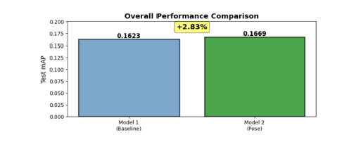

# Emotion Recognition from Body Language using EMOTIC Dataset

**SEN4107 Neural Networks Course Project**  
**Authors:** Zeynep Kızılkaya (2364532), Zeynep Nilay Yazıcı (2371998)  
**Date:** January 2026

##  Project Overview
...

##  Results

| Model | Architecture | Epochs | Test mAP | Improvement |
|-------|-------------|---------|----------|-------------|
| Model 1 | ResNet18 (Body + Context) | 20 | 0.1623 | Baseline |
| Model 2 | ResNet18 + Pose | 10 | 0.1669 | +2.83% |

##  Visualizations

All models were trained and evaluated using Google Colab.
The use of Colab enabled efficient GPU acceleration for training
deep learning models on the EMOTIC dataset.
