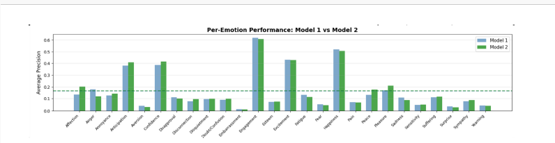

# Emotion Recognition from Body Language using EMOTIC Dataset

**SEN4107 Neural Networks Course Project**  
**Authors:** Zeynep Kızılkaya (2364532), Zeynep Nilay Yazıcı (2371998)  
**Date:** January 2026

---

## 📋 Project Overview

This project implements emotion recognition from body language using the EMOTIC dataset. We compare two deep learning architectures:

- **Model 1:** Two-stream CNN (Body + Context) using ResNet18 baseline
- **Model 2:** Three-stream CNN (Body + Context + Pose) using ResNet18 + MediaPipe Pose Estimation

---

## 🎯 Results

| Model | Architecture | Epochs | Test mAP | Improvement |
|-------|-------------|---------|----------|-------------|
| Model 1 | ResNet18 (Body + Context) | 20 | 0.1623 | Baseline |
| Model 2 | ResNet18 + Pose | 10 | 0.1669 | **+2.83%** |

---

## 📊 Visualizations

### Overall Comparison


### Model 1 Results



### Model 2 Results


---

## 📁 Repository Structure
```
emotic-emotion-recognition/
│
├── models/                    # Model architecture definitions
│   ├── model1_baseline.py    # Two-stream baseline model
│   └── model2_pose.py        # Three-stream model with pose
│
├── training/                  # Training scripts and utilities
│   ├── train_model1.py       # Training script for Model 1
│   ├── train_model2.py       # Training script for Model 2
│   └── utils.py              # Helper functions
│
├── notebooks/                 # Jupyter notebooks
│   └── Project_code.ipynb    # Complete training pipeline
│
├── results/                   # Training results and visualizations
│   ├── model1/               # Model 1 results
│   ├── model2/               # Model 2 results
│   └── comparison_visualization.png
│
├── data/                      # Dataset (not included)
│   └── README.md             # Download instructions
│
├── report.pdf                 # Complete project report
├── requirements.txt           # Python dependencies
└── README.md                  # This file
```

---

## 🚀 Quick Start

### 1. Clone the Repository
```bash
git clone https://github.com/YOUR_USERNAME/emotic-emotion-recognition.git
cd emotic-emotion-recognition
```

### 2. Install Dependencies
```bash
pip install -r requirements.txt
```

### 3. Download EMOTIC Dataset
Follow instructions in `data/README.md` to download the EMOTIC dataset.

### 4. Train Models

**Train Model 1 (Baseline):**
```bash
python training/train_model1.py
```

**Train Model 2 (with Pose):**
```bash
python training/train_model2.py
```

---

## 📊 Dataset Information

**EMOTIC Dataset:**
- **Total Images:** 23,234 high-resolution images
- **Training Set:** 17,077 samples (73.5%)
- **Validation Set:** 2,088 samples (9.0%)
- **Test Set:** 4,398 samples (17.5%)
- **Emotion Categories:** 26 discrete emotions (multi-label classification)
- **Sources:** MS COCO, FramesDB, EMODB Small, ADE20k

**26 Emotion Categories:**
- **Positive (9):** Affection, Confidence, Esteem, Excitement, Happiness, Pleasure, Contentment, Cheerfulness, Pride
- **Negative (11):** Anger, Annoyance, Disapproval, Disconnection, Disquietment, Doubt/Confusion, Embarrassment, Fear, Pain, Sadness, Suffering
- **Neutral/Social (6):** Anticipation, Aversion, Engagement, Sensitivity, Surprise, Yearning

---

## 🏗️ Model Architectures

### Model 1: Two-Stream Baseline
- **Body Stream:** ResNet18 (ImageNet pretrained) → 512-dim features
- **Context Stream:** ResNet18 (ImageNet pretrained) → 512-dim features
- **Fusion:** Concatenation (1024-dim) → FC(256) → 26 emotions
- **Parameters:** ~22.6 million
- **Training:** 20 epochs

### Model 2: Three-Stream with Pose Estimation
- **Body Stream:** ResNet18 → 512-dim features
- **Context Stream:** ResNet18 → 512-dim features
- **Pose Stream:** MediaPipe Pose (17 keypoints) → MLP Encoder → 256-dim features
- **Fusion:** Concatenation (1280-dim) → FC(512) → FC(256) → 26 emotions
- **Parameters:** ~23.2 million
- **Training:** 10 epochs

**Key Innovation:** Explicit body pose modeling through MediaPipe keypoints provides complementary geometric information beyond appearance features.

---

## 🔧 Training Configuration

**Hyperparameters:**
- **Loss Function:** Binary Cross-Entropy (BCE)
- **Optimizer:** Adam
  - Model 1: learning rate = 1×10⁻⁴
  - Model 2: learning rate = 5×10⁻⁵
- **Batch Size:** 16
- **Weight Decay:** 1×10⁻⁵
- **Learning Rate Schedule:** ReduceLROnPlateau (patience=3, factor=0.5)
- **Early Stopping:** Patience of 7 epochs on validation mAP

**Data Augmentation:**
- Random horizontal flip (p=0.5)
- Color jitter (brightness, contrast, saturation ±0.2)
- Normalization (ImageNet statistics)

---

## 📈 Key Findings

1. **Model 2 achieves 2.83% improvement** over baseline with explicit pose modeling
2. **Faster convergence:** Model 2 reaches better performance in half the epochs (10 vs 20)
3. **Best performance on:** Engagement (0.61 AP), Confidence (0.41 AP), Anticipation (0.39 AP)
4. **Pose detection success rate:** 67% with confidence >0.5, 82% with confidence >0.3

---

## 📄 Documentation

Complete project documentation available in **report.pdf**

Sections include:
- Introduction and problem statement
- Related work and literature review
- Model architectures and design choices
- Experimental setup and training details
- Results analysis and comparison
- Discussion of strengths, weaknesses, and limitations

---

## 🔗 References

1. **EMOTIC Dataset:** Kosti et al. (2017) - "Context Based Emotion Recognition using EMOTIC Dataset"
2. **Baseline Repository:** [Tandon-A/emotic](https://github.com/Tandon-A/emotic)
3. **MediaPipe Pose:** [Google MediaPipe Solutions](https://google.github.io/mediapipe/solutions/pose)
4. **ResNet:** He et al. (2016) - "Deep Residual Learning for Image Recognition"

---

## 📝 Citation

If you use this code or findings, please cite:
```
@misc{emotic2026,
  title={Emotion Recognition from Body Language using EMOTIC Dataset},
  author={Kızılkaya, Zeynep and Yazıcı, Zeynep Nilay},
  year={2026},
  institution={SEN4107 Neural Networks Course Project}
}
```

---

## 👥 Authors

- **Zeynep Kızılkaya** - Student ID: 2364532
- **Zeynep Nilay Yazıcı** - Student ID: 2371998

**Course:** SEN4107 - Neural Networks  
**Date:** January 2026

---

## 📧 Contact

For questions or issues, please open an issue in this repository.

---

## 📜 License

This project is developed for educational purposes as part of the SEN4107 course.


All models were trained and evaluated using Google Colab.
The use of Colab enabled efficient GPU acceleration for training
deep learning models on the EMOTIC dataset.
